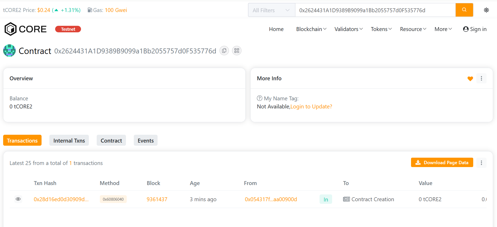

# Cryptera Network

## 🧩 Project Description
**Cryptera Network** is a decentralized blockchain protocol built on Solidity and Hardhat, enabling seamless **token creation, transfers, and approvals**. It serves as a foundation for decentralized financial systems and token-based ecosystems.

---

## 🎯 Project Vision
To create a **trustless, transparent, and scalable blockchain network** where users can securely manage their tokens and participate in decentralized ecosystems.

---

## ✨ Key Features
- **Token Creation:** Deploy a new ERC20-like token called "Cryptera Token (CRYP)".
- **Balance Management:** View and track balances directly on-chain.
- **Secure Transfers:** Send tokens between accounts safely.
- **Spender Approval:** Allow another address to spend tokens on your behalf.

---

## 🔮 Future Scope
- Implement **staking and rewards** for token holders.
- Add **governance mechanisms** for decentralized decision-making.
- Build **frontend dashboards** for user-friendly interactions.
- Integrate **cross-chain compatibility** for multi-network use.

---

address: 0x054317f26cf1974e6e579fbf9358bffdaa00900d

